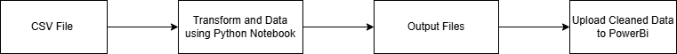

**Library Project Brief**

**Scenario** - A Library wants to improve their current quality analysis, as manually completing the tasks take too much time and is less reliable. They are looking for a more efficient way to filter data using Python and automation.

**User Stories**
As a libarian, I want a process to run automatically on a schedule so that quality checks are always up to date.
As a librarian, I want poor-quality or incomplete records to be automatically flagged so that I don't have to manually check thousands of entries.
As a library manager, I want to have the confidence in the accuracy of data and be able to view the quality analysis on a dashboard.

The idea is, a CSV file will be retrieved from a location and the contents reviewed. Transformation to the file will then begin in a Python notebook which will tidy up the below:
* Incorrect dates
* Capitalisation
* Incorrect data type in a column
* Missing values

Following this, the clean files will be pushed to the Git repository along with the Python file which performs the transformation. The .py file is called **'LibraryCleaning.py'**.
